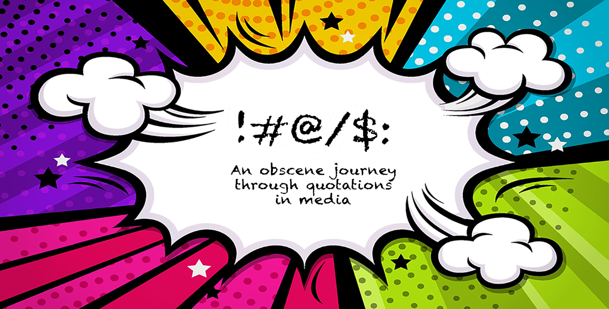

<head>
<link href="https://cdn.jsdelivr.net/npm/select2@4.1.0-rc.0/dist/css/select2.min.css" rel="stylesheet" />

</head>

## Introduction
The perception and use of profanity depend on the situation and differ from person to person. While swearing is relatively common and sometimes even welcomed in a relaxed environment, the use of such language is mostly frowned upon in a workplace or public spaces. This is why we are not likely to encounter it while reading the news. Still, heated debates and unexpected events can inspire the appearance of obscene language even in more formal settings. To better understand the circumstances in which profanity appears in media, we will explore Quotebank, a large and heterogeneous dataset of quotes extracted from media articles. We will analyze the distribution of obscene quotations through time and examine their presence with respect to the attributes of the speakers who uttered them and the media outlets who featured those speakers.

<!-- 

 -->
<!-- Furthermore, syntactically identical words can be considered obscene in one language but have a completely different meaning in another language. -->
## What is Profanity?
The dictionary offers a simple definition of the word 'profanity': a type of language that includes dirty words and ideas.

The naive approach in detecting profanity is to use a hard-coded list of curse words. However, there are glaring issues with this approach as we are completely ignoring the context surounding these words. 
<!-- Futhermore, the same word can be considered obscene in one language but have a completely different meaning in another language. -->

>"Finally! A pair of great tits has moved into my birdhouse!"

Would you classify this statement as profanity? 

It seems that Twitter would, as the user who posted it was banned from the plaftorm, even though a quick look at the wikipedia article for the [Great Tit](https://en.wikipedia.org/wiki/Great_tit "Great Tit") can easily explain the meaning of this statement.

Identifying profanity in text has proved to be a rather difficult task which, if not done carefully, can often result in a high rate of false positives, as demonstrated by the [Scunthorpe problem]( https://en.wikipedia.org/wiki/Scunthorpe_problem "Scunthorpe problem"). Therefore, we decided to use a pre-trained machine learning model in order to better identify obscene quotes in our dataset.

## 1. Profanity in Quotebank
People curse a lot, just not in media.

Quotebank is a dataset of ~110M quotes collected from different media articles. By observing the distribution of the obscene quotes identified by our models we can already reach our first conclusion:
> Obscene quotes are not common in media articles.

<iframe width="266" height="400"  frameborder="0" scrolling="no"  align="left" src="//plotly.com/~k_beans/84.embed?showlink=false" ></iframe>
<iframe width="266" height="400"  frameborder="0" scrolling="no" align="center" src="//plotly.com/~k_beans/3.embed?showlink=false"></iframe>
<iframe width="266" height="400"  frameborder="0" scrolling="no" align="right" src="//plotly.com/~k_beans/89.embed?showlink=false"></iframe>

 
Considering the temporal factor, the frequency distribution of quotes through time is mostly uniform. The sharp drops are caused by missing data, and the slight drop on March and April of 2020 can be explained by COVID-19 circumstances.

<iframe width="900" height="400" frameborder="0" scrolling="no" src="//plotly.com/~mculyak/5.embed?showlink=false"></iframe>

## 2. Zooming in 
<!-- We have uncensored all profanities by using a complex regex scheme which will allow us to to a fair analysis. -->
Isolating the profane quotes out of Quotebank leaves us with 1,146,168 quotes, out of which 68% have censored profanities.
Let's take a deep dive into this small subset of Quotebank.
> **WARNING:** Curse words ahead! 

### People's Choice Award for favorite curse word goes to...

  
Click to reveal

  <b>Hell</b> 
  <!-- I bet you expected the F word... -->
  Not quite what you expected huh? The word 'Hell' has x occurences in Quotebank, meaning it appears in around y% of all profane quotes which our model identified. The image bellow demonstrates all major obscene words found in Quotebank, where word's boldness indicates it's occurence frequency. Notice that less obscene words are more frequent which is understandable as they are more likely to be published in media articles. 
   //131k
 

### Does your mum or dad curse more? 
It seems that around 72% of all profane quotes we found were spoken by a male speaker. On the other hand, taking into consideration the relative frequenices of profane quotes with respect to all quotes spoken by a specific gender, it seems that female speakers are more prone to using profane language. Our analysis also shows that media articles are heavily biased towards featuring male speakers.
 

<iframe width="330" height="400" frameborder="0" scrolling="no" align="center" src="//plotly.com/~k_beans/211.embed?showlink=false"></iframe>
<iframe width="330" height="400" frameborder="0" scrolling="no" align="center" src="//plotly.com/~k_beans/213.embed?showlink=false"></iframe>

  

<!-- <iframe width="900" height="500" frameborder="0" scrolling="no" src="//plotly.com/~k_beans/52.embed?showlink=false"></iframe> -->
These donut plots doesn't really do justice to other genders beyond the binary ones, so let's take a look at the average profanity for some of the gender identities registered in the dataset.
 

<iframe width="900" height="500" frameborder="0" scrolling="no" src="//plotly.com/~k_beans/203.embed?showlink=false"></iframe>
<!-- <iframe width="900" height="800" frameborder="0" scrolling="no" src="//plotly.com/~k_beans/203.embed"></iframe> -->
Wow! The genderfluids are killing it.  
On the serious note, it seems that speakers associated with more uncommon genders tend to use more profane vocabulary. Psychology studies[1] suggest that the use of profanity is related to aggressive behavior. Our best guess is that people who associate themselves with uncommon genders still don't feel accepted in today's society causing them to be more hostile and therefore more prone to using profane language. We decided to further explore this hypothesis by computing average aggresion scores for each gender category. 
<iframe width="900" height="500" frameborder="0" scrolling="no" src="//plotly.com/~mculyak/46.embed?showlink=false"></iframe>
One can argue that this plot supports our hypothesis, but due to large confidence intervals, we can not make any significant claims. We still encourage readers to respect and be nice to people associated with uncommon genders.
<!-- TODO: link paper -->
<!-- Back to mum and dad, the plot also suggests that females use more profane language than males. Ladies you gotta chill. -->

<!-- ### Strippers vs. Rappers -->
<!-- MCs vs Strippers -->
### The Mic or the Stripping pole
If we had to guess, we would say that quotes by rappers would contain the most obscene language. On the contrary, our analysis shows that the most vulgar occupation of Quotebank speakers is stripping. Wait... strippers get quoted in media articles? Apperently they do, we have found over 23000 quotes spoken by strippers and this is our favorite one: 
> "quote"
That being said, MCs are not that far behind strippers. Intuition, check!
<iframe width="900" height="500" frameborder="0" scrolling="no" src="//plotly.com/~k_beans/46.embed?showlink=false"></iframe>

<!-- Monday F#@k you! -->
### F#@k it's Monday!
We have grouped quotes by the day of the week their respective articles were posted on and computed the avarage profanity score of each group. Surprise, surprise - Monday takes the lead with the highest average. [This paper](https://publications.aap.org/pediatrics/article-abstract/128/5/867/30917/Profanity-in-Media-Associated-With-Attitudes-and?redirectedFrom=fulltext "Profanity in Media Associated With Attitudes and Behavior Regarding Profanity Use and Aggression")[1] suggests that people become more hostile when exposed to profanity in media. Maybe that's the reason why people are so grumpy on Mondays, except, you know, having to go to work again.
<iframe width="900" height="500" frameborder="0" scrolling="no" src="//plotly.com/~mculyak/9.embed?showlink=false"></iframe>

## 2. Individual speakers
We will now turn our attention to individual speaker analysis. We have prepared a simple search engine which allows you to search for your favorite speakers and see their average profanity score. We have only included speakers with more than 5000 quotes so that the average profanity metric remains reasonable. After filtering, there were still over 1000 speakers left so feel free to play around.

<select style="width: 30%;" class="js-example-basic-single" name="speaker">
</select>
<code>
 

</code>

<!-- ### Drop the mic -->
<!-- ### The return of the MCs -->
### The return of the MCs
Observing the general distribution of most quoted speakers, we can see some familiar names. The profane quotes observed by Pope Francis were a bit conserning but a deeper analysis shows that they either contain the word 'hell' or are mostly false positives. Taking a look at speakers with highest percentage of profanity quotations, we can notice that most of them are rappers. The MCs are back!   
A quick trip back to the strip club: most stripper quotes belong to Cardi B, who pursued a career as an exotic dancer before rising to fame as a rapper. This further explains the domination of strippers over rappers as the most vulgar occupation.
<iframe width="900" height="500" frameborder="0" scrolling="no" src="//plotly.com/~mculyak/19.embed?showlink=false"></iframe>
<!-- <iframe width="900" height="500" frameborder="0" scrolling="no" src="//plotly.com/~k_beans/216.embed?showlink=false"></iframe> -->

### Orange case study
The most quoted speaker in Quotebank is the former American president Donald Trump. According to a popular linguistic study[?], Trump speaks at a fourth-grade level. Considering this and the amount of Trump quotes we had at our disposal, we couldn't miss the opportunity to analyse how dirty Donald's quotes are. 

## 3. Media outlets
Media outlets play a very significant role in keeping everyone updated about the various events around the world. Before jumping into the general analysis of profanity in media outlets, please take a moment to use the search bar down below to find your favorite media outlet. Then proceed to the general analysis and compare your media outlet with the rest.

<select style="width: 30%;" class="js-example-basic-single-media" name="media">
</select>
<code>
 

</code>

### You are what you read
The interesting thing about quotations is that media outlets can't alter them without losing credibility. Therefore, even if a certain media outlet has a policy against profanity, they must not alter quotations. The best they can do is censor them or not publish them at all. 

<iframe width="900" height="500" frameborder="0" scrolling="no" src="//plotly.com/~mculyak/34.embed?showlink=false"></iframe>

Quotebank data suggests that popular media outlets with a high number of quotations don't publish many profanities. Indeed, only 1-2% of quotations published by each popular outlet were considered as profane by our model. This observation, combined with relatively high censorship rates, implies a fairly strict policy against profanity among popular outlets.

On the other hand, media outlets with highest censorship rates are mostly oriented around fashion or the entertainment industry (especially hip-hop culture). Outlets with the highest profanity rate are also mostly hip-hop related! All evidence points to a single conslusion: Hip-Hopers really got no chill...
<iframe width="900" height="500" frameborder="0" scrolling="no" src="//plotly.com/~mculyak/38.embed?showlink=false"></iframe>

## Conclusion
Most of the insights from our data story can be summarized by the following sentence: don't let your kids read hip-hop magazines
Strippers, Hip-Hop, Genderfluids and Mr. Trump. It's been a wild ride.  
Most of the insights from our data story can be summarized by the following sentence: stay away from Cardi B on mondays, don't let your kids read hip-hop magazines and  
Don't let your kids read hip-hop magazines, especially on mondays. Respect non-binary genders. 
<!-- Quotebank is quite a heterogeneus dataset so there is still room for a lot of research. We have presented our most interesting insights. -->

### References
Sarah M. Coyne, Laura A. Stockdale, David A. Nelson, Ashley Fraser; Profanity in Media Associated With Attitudes and Behavior Regarding Profanity Use and Aggression. Pediatrics November 2011; 128 (5): 867–872. 10.1542/peds.2011-1062

<!-- # 4. Which speakers are most likely to use obscene language? -->
<!-- ## Are there any differences with respect to occupation, gender, or age of the speaker? -->

<!-- # 5. Which media sources feature vulgar speakers? -->
<!-- ## How does it relate to the nature of the sources and their role -->

<!-- # 6. What is the relationship between profanity and sentiment of the quotes? -->

 
<footer style="background-color: #d32f2f">
    

        

            

                

                     
                    Marko Čuljak, Mauro Staver, Daniel Hinjos Garcia & Dewmini Sudara Marakkalage
                     
                    <button id="ada"><b>ADA</b></button>, EPFL
                     
                    <a href="https://github.com/ArthurVignon/ADA_project_RADI"><b>GitHub Repository</b></a>
                    •
                    <a href="https://github.com/alcarinn/alcarinn.github.io"> <b> Website Repository </b> </a>
                     
                    <b>Theme </b>
                    <a href="https://github.com/chibicode/duo">duo</a>
                    <b>by </b>
                    <a href="https://github.com/chibicode">Shu Uesugi</a>
                     
                

            

        

    

</footer>

<a href="https://github.com/epfl-ada/ada-2021-project-k-beans" class="github-corner"><svg width="80" height="80" viewBox="0 0 250 250" style="fill:#151513; color:#fff; position: absolute; top: 0; border: 0; right: 0;">
        <path d="M0,0 L115,115 L130,115 L142,142 L250,250 L250,0 Z"></path>
        <path d="M128.3,109.0 C113.8,99.7 119.0,89.6 119.0,89.6 C122.0,82.7 120.5,78.6 120.5,78.6 C119.2,72.0 123.4,76.3 123.4,76.3 C127.3,80.9 125.5,87.3 125.5,87.3 C122.9,97.6 130.6,101.9 134.4,103.2" fill="currentColor"
            style="transform-origin: 130px 106px;" class="octo-arm"></path>
        <path
            d="M115.0,115.0 C114.9,115.1 118.7,116.5 119.8,115.4 L133.7,101.6 C136.9,99.2 139.9,98.4 142.2,98.6 C133.8,88.0 127.5,74.4 143.8,58.0 C148.5,53.4 154.0,51.2 159.7,51.0 C160.3,49.4 163.2,43.6 171.4,40.1 C171.4,40.1 176.1,42.5 178.8,56.2 C183.1,58.6 187.2,61.8 190.9,65.4 C194.5,69.0 197.7,73.2 200.1,77.6 C213.8,80.2 216.3,84.9 216.3,84.9 C212.7,93.1 206.9,96.0 205.4,96.6 C205.1,102.4 203.0,107.8 198.3,112.5 C181.9,128.9 168.3,122.5 157.7,114.1 C157.9,116.9 156.7,120.9 152.7,124.9 L141.0,136.5 C139.8,137.7 141.6,141.9 141.8,141.8 Z"
            fill="currentColor" class="octo-body"></path>
    </svg></a>

